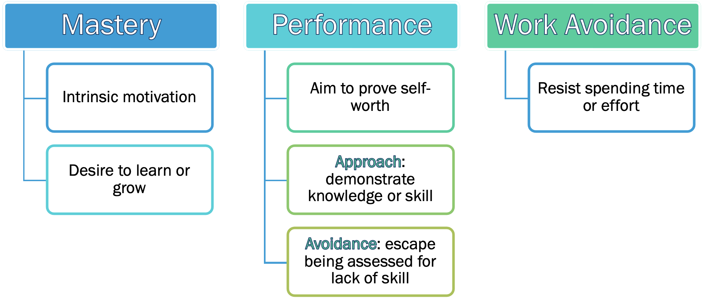
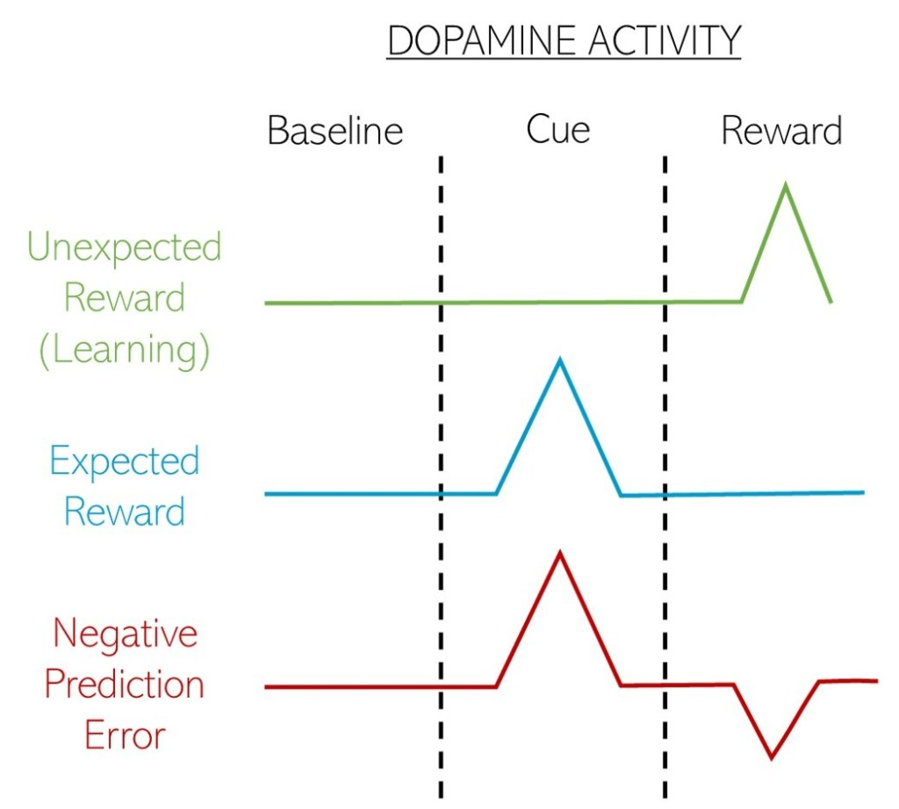
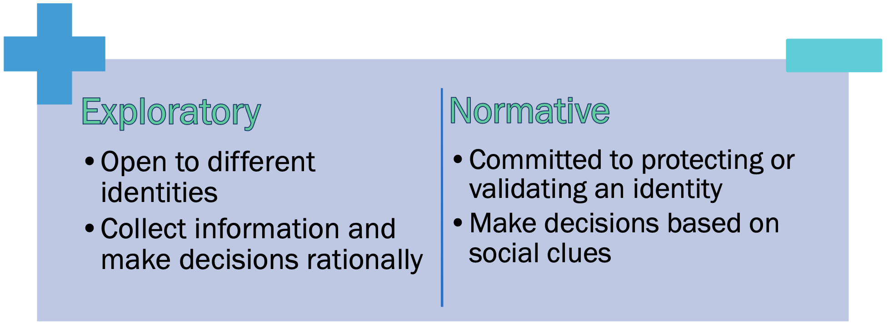

<!-- _class: title -->
<!-- _paginate: false -->
<!-- _footer: "" -->

# <!--fit--> Passion or Purpose?
## <!--fit--> Challenges of Student Motivation in the New Normal

#### **Robert W. Songer**
Associate Professor
International College of Technology, Kanazawa

###  &nbsp;&nbsp;&nbsp;[2021 CDIO Asian Regional Meeting](https://cdio2021.ack.edu.kw/)&nbsp;&nbsp;&nbsp; 
### Australian College of Kuwait, 26-28 October

---
<!-- _class: profile -->

# Who Am I?
**Robert W. Songer**

**Associate Professor**
Global Information & Management
[International College of Technology, Kanazawa](https://www.ict-kanazawa.ac.jp/)

:mortar_board: **PhD Candidate**
Information and Computer Engineering
[Kanazawa Institute of Technology](https://www.kanazawa-it.ac.jp/ekit/index.html)

---

# About International College of Technology
#  

### "Fostering Global Innovators"
* 5-year High School and Junior College
* Student ages: 15 to 20 years

### Department of Science and Technology
* CDIO-based STEAM Education
* Specialized Engineering Tracks from 3rd year

---
<!-- _footer: "" -->

# School Closures 
## In April, 2020
**1.25 million** affected
**71.8%** of all learners
###### UNESCO, [Education: From Response to Recovery](https://en.unesco.org/covid19/educationresponse). Accessed October, 2021.

---

# EdTech to the Rescue

Digital technology revolutionizing education:
* Online learning platforms
* Learning analytics tools in educational apps
* Access to high quality materials
* Free or low-cost information and knowledge
* Online communities of experts

---

# The "Digital Divide" (1)

Socioeconomic factors influence ***access*** and ***usage*** of emerging technologies.

Affluent schools are more likely to:
* Provide computers/tablets for students to use
* Use computers for modeling/simulation activities vs. drills/practice
* Apply **free** web tools for collaborative problem solving & new media literacy

Massively Open Online Course (MOOC) participants are mostly college-educated.
MOOC completion rates modestly correlate with educational attainment levels.

---

# The "Digital Divide" (2)

Hansen et al. examined socioeconomic status (SES) of HarvardX and MITx MOOC students.
(SES includes parents education level, neighborhood income, and neighborhood education)
* MOOC students were mostly from high-SES neighborhoods
* Certificate completion rates were highest for high-SES students as well
* These patterns were particularly strong among adolescents

> "Closing gaps with digital learning resources requires targeting innovation towards the students most in need of additional support and opportunity."

###### Hansen, J. D., and Reich, J. (2015). [Democratizing Education? Examining Access and Usage Patterns in Massive Open Online Courses](http://nrs.harvard.edu/urn-3:HUL.InstRepos:23928053). Science 350, no. 6265: 1245-1248.

--- 

# The EdTech "Matthew Effect"

> "For whoever has will be given more, and they will have an abundance. Whoever does not have, even what they have will be taken away from them." Matthew 13:12

[Justin Reich](https://cmsw.mit.edu/profile/justin-reich/) describes the digital divide as more of a "digital fault line":

1. Technology embeds systems of inequality rather than disrupting them.
2. Free tech benefits those who can take advantage of it rather than those in need.
3. Social and cultural ***exclusion*** is more powerful than access to technology.

###### Reich, J. (2020). Failure to Disrupt: Why Technology Alone Can’t Transform Education. Harvard University Press, 2020

---

# Example:  Social Identity Threat

Fear of being seen as less capable based on one's race, gender, nationality, status, etc.

Low **persistence** and **completion rates** for MOOC students from less-developed countries† can be mitigated with "social belonging interventions".

##### † According to the [United Nations Human Development Index](http://hdr.undp.org/en/content/human-development-index-hdi)

###### Kizilcec, R. F., Saltarelli, A. J., Reich, J., & Cohen, G. L. (2017). [Closing global achievement gaps in MOOCs](https://www.science.org/doi/10.1126/science.aag2063). Science, 355(6322), 251–52.

<!-- Researchers experimented with "social belonging interventions" as brief reflection activities at the start of the course. -->
<!-- "Psychological and learning sciences can can help turn an accessible educational experience into an equitable one." -->

---

# Social Exclusion Undermines Motivation

Factors of engagement include student-perceived **value of outcome** and **cost to achieve it**.
- **Approach Motivation**: When a high perceived value outweighs the cost 
- **Avoidance Motivation**: When cost (effort, identity threat) outweighs perceived value 

- **Intrinsic Motivation**: The activity itself is valuable (enjoyment, mastery)
- **Extrinsic Motivation**: Some other reward can be gained (money, recognition) 

---

# Achievement Goal Theory

---

# Student Grade Obsession

Performance-oriented achievement driven by extrinsic rewards can be disastrous.
Students may be under pressure to perform for various reasons:
- Achieve qualifications (i.e., scholarships)
- Improve employability
- Live up to the expectations of one's teachers, parents, and/or self

Consequences include anxiety, cheating, a malformed self-concept, intellectual dependency on teacher approval, and undermined intrinsic motivation to learn.

<!-- Ultimately, grade obsession can occur as an extreme result of the operant conditioning inherent to point-based rewards -->

---

# The Paradox of Higher Education

Cultural assumptions can turn institutes of learning into hierarchical structures of self-worth.

- Favorable evaluation motivates students to work harder
- Grading is a fair, reliable, and objective system for measuring accomplishments
- Students and teachers must be accountable for proof of achievements

---
<!-- _footer: "" -->

# Behavioral Reinforcement

The human mind learns to predict rewards through dopamine responses.
Over time, the expectation replaces the reward itself in terms of efficacy.
When this prediction fails, a negative signal weakens the connection.

###### Image Credit: Rebecca Clements, [Science in the News](https://sitn.hms.harvard.edu/flash/2018/dopamine-smartphones-battle-time/)

---

# The Myth of Sysiphus

***The Absurd***:
We struggle to understand our purpose in a world that offers no answers.
Repetition is meaningless as it gets us nowhere.

***The Antidote***:
The lack of a *given* meaning allows for *interpreted* meaning.
Each iteration offers a new perspective.

<!-- Albert Camus believed that in a world with no clear meaning or purpose, we must conquer our own fates. -->
<!-- In his essay 'The Myth of Sysiphus', he describes a mythological figure who became a hero of the absurd. -->
<!-- Sysiphus was a man who lived with such great love and passion for life, he tricked the gods twice to cheat death. -->
<!-- As a result, the gods condemned him to push a boulder up a hill only for it to roll back down again for all eternity. -->
<!-- According to Camus, Sysiphus rises above his punishment by facing the absurdity of it and realizing its meaninglessness. -->
<!-- Doing so frees him from the drudgery and allow him to create his own meaning/rediscover passion in the activity. -->
<!-- The lack of inherent meaning in things allows us to define our own purpose and become truly happy in our pursuits. -->
<!-- Camus argues that even though Sisyphus is trapped in a repetitive structure, within that structure he is free.  -->
<!-- “His fate belongs to him. His rock is his thing. . . he knows himself to be the master of his days.” -->
<!-- The Japanese have a phrase "Ichi-go Ichi-e" (一期一会) which means exact moments can never be repeated and so should be cherished as once-in-a-lifetime experiences. -->

---

# Finding Your Passion:  Growth Mindset Vs. Fixed Mindset

Students who believe their interests to be fixed:
- are less engaged with topics outside their existing interests,
- believe passions provide limitless motivation without difficulties, and
- disengage faster when potentially new interests became difficult.

*There are many similarities between a growth mindset and an exploratory identity.*

###### O'Keefe, P. A., Dweck, C. S., Walton, G. M. (2018). Implicit Theories of Interest: Finding Your Passion or Developing It? Psychological Science 2018, Vol. 29(10) 1653–1664.  DOI: [10.1177/0956797618780643](https://doi.org/10.1177/0956797618780643)

<!-- A band of researchers including Carol Dweck, the American Psychologist famous for her theory of intelligence, decided to test the theory for interests as well. -->
<!-- Five studies examined students with a fixed mindset vs growth mindset regarding their interests. -->
<!-- "The fixed mindset is an identity statement." -->

---

# Identity Status Theory

---

# Models of Motivation Rooted in Culture

**Independent model of motivation** in individualistic "Western" societies
- Achievement is higher in students with stronger interest, enjoyment, and confidence
- Motivated by personal interests and enjoyment, ***PASSION***
  
**Interdependent model of motivation** in collectivistic "Eastern" societies
- Achievement is higher for students with strong connections to supportive others
- Motivated by social expectation and contribution, ***PURPOSE***

---

# Predicting Achievement from Passion

Li et al. found passion was less of a predictor for achievement in collectivistic societies than in Western, educated, industrialized, rich, and democratic (WEIRD) societies.
* The role of passion should not be overemphasized in diverse learning environments.
* Researchers need measures of interdependent motivation for collectivistic contexts:
  * Perceived norms in the classroom
  * Sense of belonging
  * Responsibility to one's family

###### Li, X. Han, M., Cohen, G. L., Markus, H. R. (2021). Passion matters but not equally everywhere: Predicting achievement from interest, enjoyment, and efficacy in 59 societies. Proceedings of the National Academy of Sciences Mar 2021, 118 (11) e2016964118; DOI: [10.1073/pnas.2016964118](https://doi.org/10.1073/pnas.2016964118)

<!-- Li and associates analyzed PISA datasets from 2009 to 2015 -->
<!-- WEIRD societies made up about half of the 59 included -->
<!-- PISA datasets included variables for "interest", "enjoyment", and "efficacy" -->
<!-- In collectivistic socieites, parental emotional support out-performed passion indicators -->

---

# The Case of Tokido:  Passion Drives Purpose 

Hajime "Tokido" Taniguchi
University of Tokyo
Graduate School of Engineering, 2010

**Competitive Fighting Game Champion**
Approx. Total Winnings: $585,359

:arrow_right: Found renewed purpose in his passion for games.

###### Photo Credit: [TOPANGA](https://www.openrec.tv/live/ovrdx3egy8j)

<!-- Tokido was driven by his studies and focused on his research in school -->
<!-- His narrow-focused approach was not to ask "why?" but to set a goal and find the most efficient way to proceed. -->
<!-- He could enjoy his research into developing artifical bones and organs because he felt he was contributing to society. -->
<!-- He even won a national award for his capstone research thesis. -->
<!-- But his focus on research meant he didn't study for graduate school exams and could not score high enough to get into the lab he wanted. -->
<!-- The lab he ended up in was not a good fit and he quickly became unsatisfied not being able to contribute -->
<!-- At that time, pro gaming was growing rapidly and he saw other fighters of lower skill gaining recognition -->
<!-- So he followed his passion and readjusted his purpose to become the world's top fighting champion. -->

---

# The Case of Afaf:  Purpose Guides Passion

2nd year student 
International College  ofTechnology

**Video Producer** and **Contestant**
[Space Debris - Breakthrough Junior Challenge 2021](https://youtu.be/TvXXeqMk_9c)

:arrow_right: A strict goal allowed her to explore her interests.

<!-- Afaf is a member of the Design and Fabrication Club where students are expected to make projects as they like -->
<!-- She joined the Breakthrough Junior Challenge contest where teenagers make a 3-minute video about science -->
<!-- Studying video editing on its own would be boring, so she joined the competition to have a deadline -->
<!-- Managed the process of choosing a topic, scripting, filming and editing by planning with a Gantt chart -->

---

# Take Away Advice for Addressing Motivation

* Foster a sense of belonging by explicitly centralizing diverse perspectives
* Apply grading to promote self-reflection/formative assessments  
* Cultivate a growth mindset for both learning and interest
* Establish clear expectations and norms without undermining personal autonomy

---

# <!-- fit --> Thank You