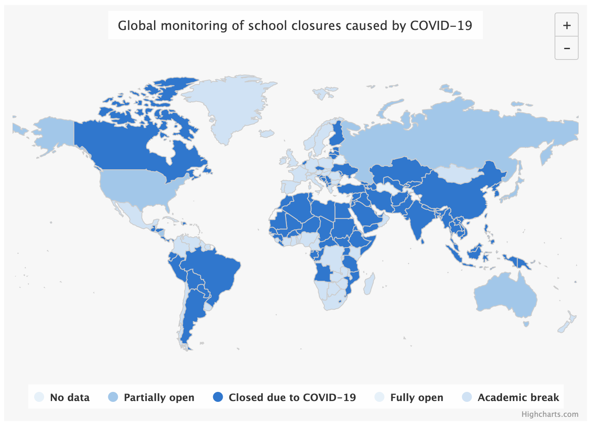
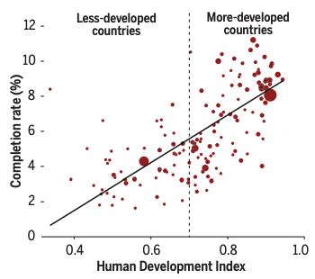

<!-- _class: title -->
<!-- _paginate: false -->
<!-- _footer: "" -->

# <!--fit--> Passion or Purpose?
## <!--fit--> Challenges of Student Motivation in the New Normal

#### **Robert W. Songer**
Associate Professor
International College of Technology, Kanazawa

###  &nbsp;&nbsp;&nbsp;[2021 CDIO Asian Regional Meeting](https://cdio2021.ack.edu.kw/)&nbsp;&nbsp;&nbsp; 
### Australian College of Kuwait, 26-28 October
View these slides at https://bit.ly/CDIOAsia2021

---
<!-- _class: profile -->

# Who Am I?
**Robert W. Songer**

**Associate Professor**
Global Information & Management
[International College of Technology, Kanazawa](https://www.ict-kanazawa.ac.jp/)

:mortar_board: **PhD Candidate**
Information and Computer Engineering
[Kanazawa Institute of Technology](https://www.kanazawa-it.ac.jp/ekit/index.html)

---

# About International College of Technology
#  

### Mission: To Foster Global Innovators
- 5-year High School and Junior College level CDIO-based STEAM Education
- Students transfer to university at 3rd-year level after graduation

### Department of Science and Technology
- Integrated engineering experiences in first three years
- Specialized engineering tracks from 4th year

---
<!-- _footer: "" -->

# School Closures 
## In April, 2020
**1.25 million** affected
**71.8%** of all learners
###### UNESCO, [Education: From Response to Recovery](https://en.unesco.org/covid19/educationresponse). Accessed October, 2021.

---
<!-- _footer: "" -->

# EdTech to the Rescue

Digital technology revolutionizing education:
* Online learning platforms
* Learning analytics tools in educational apps
* Access to high quality materials
* Free or low-cost information and knowledge
* Online communities of experts

---

# The "Digital Divide" (1)

Socioeconomic factors influence ***access*** and ***usage*** of emerging technologies.

Affluent schools are more likely to:
- Provide computers/tablets for students to use
- Use computers for modeling/simulation activities vs. drills/practice
- Apply **free** web tools for collaborative problem solving & new media literacy

Massively Open Online Course (MOOC) participants are mostly college-educated.
MOOC completion rates modestly correlate with educational attainment levels.

---

# The "Digital Divide" (2)

Hansen et al. examined socioeconomic status (SES) of HarvardX and MITx MOOC students.
(SES includes parents education level, neighborhood income, and neighborhood education)
- MOOC students were mostly from high-SES neighborhoods
- Certificate completion rates were highest for high-SES students as well
- These patterns were particularly strong among adolescents

> "Closing gaps with digital learning resources requires targeting innovation towards the students most in need of additional support and opportunity."

###### Hansen, J. D., and Reich, J. (2015). [Democratizing Education? Examining Access and Usage Patterns in Massive Open Online Courses](http://nrs.harvard.edu/urn-3:HUL.InstRepos:23928053). Science 350, no. 6265: 1245-1248.

--- 

# The EdTech "Matthew Effect"

> "For whoever has will be given more, and they will have an abundance. Whoever does not have, even what they have will be taken away from them." Matthew 13:12

[Justin Reich](https://cmsw.mit.edu/profile/justin-reich/) describes the digital divide as more of a "digital fault line":

1. Technology embeds systems of inequality rather than disrupting them.
2. Free tech benefits those who can take advantage of it rather than those in need.
3. Social and cultural ***exclusion*** is more powerful than access to technology.

###### Reich, J. (2020). Failure to Disrupt: Why Technology Alone Can’t Transform Education. Harvard University Press, 2020

---

# Example:  Social Identity Threat

Fear of being seen as less capable based on one's race, gender, nationality, status, etc.

Low **persistence** and **completion rates** for MOOC students from less-developed countries† can be mitigated with "social belonging interventions".

##### † According to the [United Nations Human Development Index](http://hdr.undp.org/en/content/human-development-index-hdi)

###### Kizilcec, R. F., Saltarelli, A. J., Reich, J., and Cohen, G. L. (2017). Closing global achievement gaps in MOOCs. Science, 355(6322), 251–52. DOI: [10.1126/science.aag2063](https://www.science.org/doi/10.1126/science.aag2063)

<!-- Researchers experimented with "social belonging interventions" as brief reflection activities at the start of the course. -->
<!-- "Psychological and learning sciences can can help turn an accessible educational experience into an equitable one." -->

---

# Passion or Purpose?

Factors of engagement include student-perceived **value of outcome** and **cost to achieve it**.
|  | Passion | Purpose |
| :---: | --- | --- |
| **Value of  Outcome** | - Personal interest & enjoyment - Mastery, growth and learning - Building self-efficacy | - Sense of identity/self-worth - Status and recognition - Contribution to family/society |
| **Cost of  Achievement** | - Boredom and irrelevance - Mistakes hurt self-confidence | - Experience of social exclusion - Wasted time on little progress |

* **Approach Motivation**: When the perceived **value** outweighs the **cost** 
* **Avoidance Motivation**: When the perceived **cost** outweighs the **value** 

<!-- Social exclusion is so powerful precisely because it can undermine other motivational factors -->

---

# Cultural Models of Motivation

**Independent model of motivation** in individualistic "Western" societies
- Achievement is higher in students with stronger interest, enjoyment, and confidence
- Motivated by personal interests and enjoyment, ***PASSION***
  
**Interdependent model of motivation** in collectivistic "Eastern" societies
- Achievement is higher for students with strong connections to supportive others
- Motivated by social contribution and expectation, ***PURPOSE***

---

# Predicting Achievement from Passion

Li et al. found passion was less of a predictor for achievement in collectivistic societies than in Western, educated, industrialized, rich, and democratic (WEIRD) societies.
- The role of passion should not be overemphasized in diverse learning environments.
- Researchers need measures of interdependent motivation for collectivistic cultures:
  * Perceived norms in the classroom
  * Sense of belonging
  * Responsibility to one's family

###### Li, X. Han, M., Cohen, G. L., Markus, H. R. (2021). Passion matters but not equally everywhere: Predicting achievement from interest, enjoyment, and efficacy in 59 societies. Proceedings of the National Academy of Sciences Mar 2021, 118 (11) e2016964118; DOI: [10.1073/pnas.2016964118](https://doi.org/10.1073/pnas.2016964118)

<!-- Li and associates analyzed PISA datasets from 2009 to 2015 -->
<!-- WEIRD societies made up about half of the 59 included -->
<!-- PISA datasets included variables for "interest", "enjoyment", and "efficacy" -->
<!-- In collectivistic socieites, parental emotional support out-performed passion indicators -->

---

# Motivation in Educational Psychology

Carol Ames' **Achievement Goal Theory** describes task orientation and ego orientation.
- **Task orientation** focuses on completing some task to the best of one's ability.
  - Associated with positive cognitive, affective, and behavioural outcomes
- **Ego orientation** focuses on one's performance relative to that of others.
  - Outcomes suffer when perceived competence is low

The *motivational climate* of the classroom sets the stage for student orientations.

###### Ames, C. (1992). Achievement goals and the classroom motivational climate. In D. H. Schunk & J. L. Meece (Eds.), Student perceptions in the classroom (pp. 327–348). Lawrence Erlbaum Associates, Inc.

<!-- I view passion and purpose as a kind of macro-motivation embedded in the motivational climate of school or society. -->
<!-- A student driven by passion might put forth effort to have fun or develop their skills. -->
<!-- On the other hand, a student driven by purpose would do so because they have expectations to meet for themselves or others. -->
<!-- So while passion and purpose can describe WHY a student is involved in a task, goal orientation describes HOW. -->
<!-- How they engage is reflected in the dialog surrounding the task (types and levels of goals, nature of feedback, evaluation criteria, and recognition of accomplishment) which can be focused on the task itself or the individual's ability. -->
<!-- For example, in Japanese culture, there is a strong emphasis on doing one's best (頑張る) -->
<!-- In situations where other cultures will say "Good luck!", the Japanese say "Do your best!" and satisfaction is often derived from effort. -->
<!-- Even when a student is not able to achieve their desired goal, they are reassured having put in their best effort. -->

---

# The Necessity of Passion (1)

Institutes of higher education must handle two competing objectives:
Promoting holistic learning and accrediting student accomplishments

The role of grades is influenced by **cultural assumptions**:
* Favorable evaluation motivates students to work harder
* Grading is a fair, reliable, and objective system for measuring accomplishments
* Students and teachers must be accountable for proof of achievements

<!-- Contention between two competing purposes in institutes of higher education: learning and assessment -->
<!-- The degree to which grades play a role in learning is influenced by cultural assumptions. -->
<!-- These assumptions may come from the culture of the social context or the culture of the school. -->
<!-- A highly competitive university for example may put a stronger emphasis on the role of grades in order to distinguish their students. -->

---

# The Necessity of Passion (2)

**Student grades obsession**: extreme ego-oriented achievement driven by extrinsic rewards.

Students may be under pressure to perform for various reasons:
- To achieve qualifications (i.e., scholarships)
- To improve employability
- To live up to the expectations of one's teachers, parents, and/or self

Consequences include anxiety, cheating, a malformed self-concept, intellectual dependency on teacher approval, and undermined intrinsic motivation to learn.

<!-- Ultimately, grade obsession can occur as an extreme result of this overemphasizing the role of grades. -->

---
<!-- _paginate: false -->

# The Myth of Sysiphus

***The Absurd***:
We struggle to understand our purpose in a world that offers no answers.
Repetition is meaningless as it gets us nowhere.

***The Antidote***:
The lack of a *given meaning* in life invites us to master an *interpreted meaning*.
Iterating over things gives new perspective each time.

<!-- French philosopher Albert Camus believed that in a world with no clear meaning or purpose, we must conquer our own fates. -->
<!-- In his essay 'The Myth of Sysiphus', he describes a mythological figure who became a hero of his own absurd situation. -->
<!-- Sysiphus was a man who lived with such great love and passion for life, he tricked the gods twice in order to cheat death. -->
<!-- As a result, the gods condemned him to an eternity pushing a boulder up a hill only for it to roll back down again. -->
<!-- According to Camus, Sysiphus rises above his punishment by facing the absurdity of it and realizing its inherent meaninglessness. -->
<!-- Doing so frees him from the drudgery and allows him to create his own meaning and rediscover passion in the activity. -->
<!-- The lack of inherent meaning in things allows us to define our own purpose and become truly happy in our pursuits. -->
<!-- Camus argues that even though Sisyphus is trapped in a repetitive structure, within that structure he is free.  -->
<!-- “His fate belongs to him. His rock is his thing. . . he knows himself to be the master of his days.” -->
<!-- The Japanese have a phrase "Ichi-go Ichi-e" (一期一会) which means exact moments can never be repeated and so should be cherished as once-in-a-lifetime experiences. -->

---
<!-- _paginate: false -->

# "Do What You Love" (DWYL) Advocation

Assumptions behind DWYL advice for students:
* All students have the potential to be successful if they just find their passion and work hard at it.
* Everybody has multiple career options and full agency regarding the direction of their career.
* All work should serve a passion or eventually evolve to that point.

###### Stebleton, M. J. (2019). Moving Beyond Passion: Why “Do What You Love” Advice for College Students Needs Reexamination, Journal of College and Character, 20:2, 163-171, DOI: [10.1080/2194587X.2019.1591289](https://doi.org/10.1080/2194587X.2019.1591289)

<!-- In his 2005 commencement address at Standford University, Steve Jobs famously told the graduates to find what they love. -->
<!-- Especially in America which follows an independent model of motivation, discovering one's passion is viewed as the golden key that unlocks a happy and successful life and career. -->
<!-- While this is great advice as we previously established that passion is necessary, it only covers half of the picture. -->
<!-- Students who view passion as inherently individualistic and privileged may respond better to an idealistic purpose that emphasizes collective meaning. -->
<!-- Furthermore, the amount of time and freedom to explore one's career options may not be available to students who have limited resources, student debt, or obligations towards family. -->
<!-- Students may not be fully aware of the messages and circumstances influencing their decisions. It is worthwhile for them to reflect on their values, skills, and knowlege about future prospects in an effort to pursue interests, but discoverying a "true passion" is not necessary and may be simply impractical for many. -->

---

# Finding Your Passion:  Growth Mindset Vs. Fixed Mindset

Students who believe their interests to be fixed:
- are less engaged with topics outside their existing interests,
- believe passions provide limitless motivation without difficulties, and
- disengage faster when potentially new interests became difficult.

*There are many similarities between a growth mindset and an exploratory identity.*

###### O'Keefe, P. A., Dweck, C. S., and Walton, G. M. (2018). Implicit Theories of Interest: Finding Your Passion or Developing It? Psychological Science 2018, Vol. 29(10) 1653–1664. DOI: [10.1177/0956797618780643](https://doi.org/10.1177/0956797618780643)

<!-- A band of researchers including Carol Dweck, the American Psychologist famous for her theory of intelligence, decided to test the theory for interests as well. -->
<!-- Five studies examined students with a fixed mindset vs growth mindset regarding their interests. -->
<!-- "The fixed mindset is an identity statement." -->

---

# Exploration in STEM

While a fixed mindset is an identity statement, growth mindset is akin to exploratory identity development.
- Normative identity
- Exploratory identity 

###### Perez, T., Cromley, J. G., and Kaplan, A. (2014). The role of identity development, values, and costs in college STEM retention. Journal of Educational Psychology, 106(1), 315–329. DOI: [10.1037/a0034027](https://doi.org/10.1037/a0034027)

---
<!-- _paginate: false -->

# The Case of Afaf:  Purpose Guides Passion

2nd year student 
International College of Technology

**Video Producer** and **Contestant**
[Space Debris - Breakthrough Junior Challenge 2021](https://youtu.be/TvXXeqMk_9c)

:arrow_right: A strict goal helped her to explore her interests.

<!-- Afaf is a member of the Design and Fabrication Club where students are expected to make projects as they like -->
<!-- She joined the Breakthrough Junior Challenge contest where teenagers make a 3-minute video about science -->
<!-- Studying video editing on its own would be boring, so Afaf joined the competition to have a deadline -->
<!-- Managed the process with a Gantt chart to plan choosing a topic, scripting, filming and editing -->

---
<!-- _paginate: false -->

# The Case of Tokido:  Passion Drives Purpose 

Hajime "Tokido" Taniguchi
University of Tokyo
Graduate School of Engineering, 2010

**Competitive Fighting Game Champion**
Approx. Total Winnings: $585,359

:arrow_right: Found renewed purpose in his passion for games.

###### Photo Credit: [TOPANGA](https://www.openrec.tv/live/ovrdx3egy8j)

<!-- Tokido was driven by his studies and focused on his research in school -->
<!-- His narrow-focused approach was not to ask "why?" but to set a goal and find the most efficient way to proceed. -->
<!-- He could enjoy his research into developing artifical bones and organs because he felt he was contributing to society. -->
<!-- He even won a national award for his capstone research thesis. -->
<!-- But his focus on research meant he didn't study for graduate school exams and could not score high enough to get into the lab he wanted. -->
<!-- The lab he ended up in was not a good fit and he quickly became unsatisfied not being able to contribute -->
<!-- At that time, pro gaming was growing rapidly and he saw other fighters of lower skill gaining recognition -->
<!-- So he followed his passion and readjusted his purpose to become the world's top fighting champion. -->

---

# Take Away Advice for Addressing Motivation

* Foster a sense of belonging by explicitly centralizing diverse perspectives
* Apply grading to promote self-reflection/formative assessments  
* Cultivate a growth mindset for both learning and interest
* Establish clear expectations and norms without undermining personal autonomy
* Consider reflection activities that relate subject matter to students' sense of purpose
* Maintain a balance between language of passion and language of purpose

<!-- Self-reflection into one's interests, values, skills, occupational knowledge, and the future of work with the goal of discovering a self-purpose would serve students who have a limited understanding of their possibilities. -->

---

# <!-- fit --> Thank You
 View these slides at https://bit.ly/CDIOAsia2021